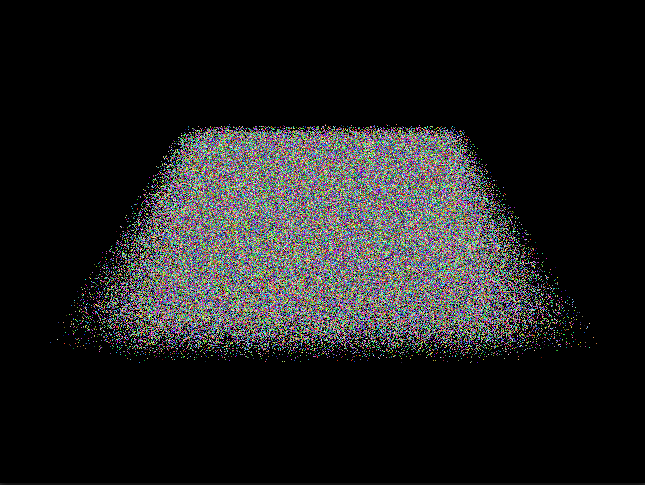

#Vulkan Physics
A basic example of using vulkan to run physics calculations on a GPU.

Built and tested on Linux and Windows so far, should be portable enough to other systems.

Was tested using a GTX1070, happily managed to simulate 5,000,000 particles before having issues.

The code is far from perfect, this is mainly a test for the code in 'vulkanutils'.
If you're thinking of borrowing any of this code best to get in touch for an updated version as there's a lot of functionality missing.

 